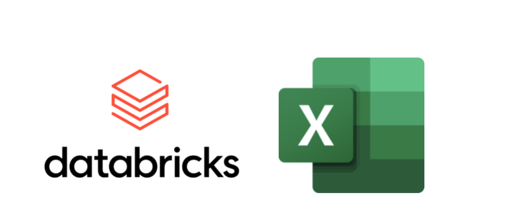

# dbx-excel-mail



Welcome to a proof-of-concept implementation of automating SQL-based query results to select email recipients, provided in the form of a Databricks App and several pre-written and configured Notebooks designed to work with common email protocols and services.

## Why do this?

Today, Databricks provides limited support for emailing users query results on a schedule. Alerts exist, but only the first 100 rows are sent to the user. A common question people ask when considering moving to a platform like Databricks is "how do we schedule automatic reports?" The unsaid part of that question is "How do we send *Excel* files as reports on a schedule?"

Creating Excel files as an output in Databricks is possible, but it requires users to know Python. There's also the challenge of configuring a notebook to talk to various Email servers or services. All of which require development time and testing, resulting in multiple people or teams being involved in something that the end-users already had on a different platform.

But what if there was a way to where all the user had to do was write a query in the Databricks SQL editor (or be given access to a query already), then open a simple interface that would create a scheduled job for them that ran a Notebook already set up to do this? Then, users could self-service the scheduling and emailing of the reports. That's what this solution is designed to do.

## How does it work?

This solution uses Databricks Apps to put a nice front end around scheduling a notebook job that runs a query and saves the result as an Excel file and sends it as an email attachment. It uses on-behalf of authentication to determine which saved SQL queries the user has access to, and then turns around and builds the scheduled job as the user (and runs as the user). This user then has the ability to edit the job as needed.

## A tour of the repository

This proof of concept is provided in the form of a Databricks Asset Bundle. The layout is as follows:

```
├── databricks.yml - Databricks Asset Bundle Configuration / Deployment Details
├── img
│   └── dbx-excel-mail-logo.png
├── README.md
└── src
    ├── app - 
    │   ├── app.py - Databricks App Code / Streamlit App
    │   ├── app.yaml - Databricks App Confoguration / Open this to edit which notebook to call, which email to send from, etc.
    │   ├── img
    │   │   ├── Databricks_Logo.png
    │   │   └── Excel_Logo.png
    │   └── requirements.txt
    ├── Query And Email Results - Basic SMTP.ipynb - Notebook to be used with basic SMTP server/services
    ├── Query And Email Results - GMail API.ipynb - Notebook to be used with the GMail API
    └── Query And Email Results - O365 Exchange.ipynb - Notebook to be used with O365 / Exchange Direct Send
```

## Deploying this solution

**As of 29/09/25:** Before you deploy, please enable the preview feature "Databricks Apps - On-Behalf-Of User Authorization" from your Workspace preview tab. Details here: https://docs.databricks.com/aws/en/admin/workspace-settings/manage-previews 

To get started right away, follow these steps:

1. Clone this repostitory locally
2. First, open the `app.yaml` file in the `src/app` folder, and edit the `EMAIL_NOTEBOOK_PATH` and `MAIL_FROM` values. These will be used by the app when configuring the job. The `EMAIL_NOTEBOOK_PATH` value should be one of the provided notebooks (or one you edit/author), and your MAIL_FROM value should be a valid mailbox (or else some mail services/services may complain). The value provided in this repository is set to the basic SMTP notebook. Note the full path of the notebook; this corresponds to the deployment location in the `daatabricks.yml` path in in the `root` and `file_path` paths.
3. Using the Databricks CLI (which should be authenticated to the workspace you want to deploy to), run the command `databricks bundle deploy`
4. Next, set your secret scopes and values
    1. A secret scope must exist named `dbx-mail-secerts`
    2. Individual secrets need created depending on which Notebook you are running; open each to determine what you need to set
    3. Use the Databricks CLI commands `databricks secrets create scope` and `databricks secrets put-secret <secret name>` to set the correct secrets and keys
5. Once your app is created in Databricks, deploy your code. You can either do this in the UI by clicking "Deploy" or with the CLI.
6. Wait for your app to become available.
7. This application uses "on-behalf of" authentication, however, the provided scopes in the `databricks.yml` file aren't enough. You need to manually assign the `all-apis` scope which cannot be done with the UI. To resolve this:
    1. Get your Databricks Application OAuth ID from your Databricks UI (it should be a GUID) in the "Authorization Tab" of the App page
    2. Using the Databricks CLI, get the current custom app integration setting for the app by running `databricks account custom-app-integration get <your application OAuth ID>`
    3. In the returned JSON structure, look for the `scopes` section and copy all the values
    4. You need to append `all-apos` scope to the list; for example, if your returned `scopes` was `"scopes": ["sql"]` you need to edit it to add the new scope at the end with the `databricks account custom-app-integration update <your application OAuth ID> --json '{"scopes": ["sql","all-apis"]}'` (Your existing scopes will probalby vary, but your should get the idea).
    5. Re-deploy your application and launch it and try it out!

### What's next?

This solution will be a work in progress, and there is scheduled updates that will provide:

1. The ability for SQL queries accept parameters
2. The ability to set the catalog/schema in the query settings (queries should use 3-part names for now)


